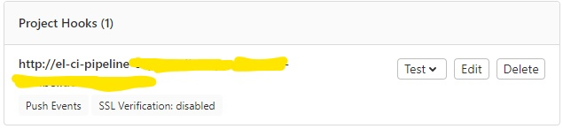

# Continuous Integration and Continuous Delivery (CICD) on OpenShift - Reference Implementation


This article will attempt to walk you through a Reference Implementation of OpenShift Continuous Integration and Continuous Delivery (CICD) using a sample Quarkus project. For the sake of simpicity, the article will be broken down into 2 sections. They are as follows:-

* [Continuous Integration Reference Implementation on OpenShift using OpenShift Pipelines](#continuous-integration-reference-implementation-on-openShift-using-openShift-pipelines)
  
* [Continuous Delivery Reference Implementation on OpenShift using OpenShift GitOps](#continuous-delivery-reference-implementation-on-openshift-using-openshift-gitOps)


## Continuous Integration Reference Implementation on OpenShift using OpenShift Pipelines

OpenShift Pipelines are based on the Tekton project (https://tekton.dev) - a new, Kubernetes and container native way to manage pipelines.

The purpose of this article is demonstrate a reference implementation for the Openshift Pipelines using a sample Quarkus project.

The pipeline will look like this:-


The pipeline will:

* Clone the source code repository (https://gitlab.xxx.corp.xxx.ca/AI/aiocp/sample-reactive-quarkus-app.git) on commit to `dev` branch
  
* Run test cases
* Build artifact for image
* In parallel scan build artifact for vulnerabilities using a [`Trivy`](https://github.com/aquasecurity/trivy) task.
* Build an tag image using the source code `commitId`
* In parallel scan image locally for vulnerabilities using a `Trivy`](https://github.com/aquasecurity/trivy) task
* Push image to image repository - artifactory.xxxx.corp.xxx.ca:5073 (`ccop-dev` repo)
* Scan image in remote image repository for vulnerabilities using a `Trivy`](https://github.com/aquasecurity/trivy) task
* Update the repository https://gitlab.xxx.corp.xxx.ca/AI/aiocp/tekton-pipeline.git under the path `k8s/overlays/dev` in `dev` branch to point to the latest image in the Artifactory registry


The Goal of this article is:

    * Understand how to setup a CICD pipeline using OpenShift pipelines(Tekton) and OpenShift GitOps(ArgoCD)
    * Serve as a quickstart for your CICD pipeline


### Prerequisites


The following are required to run this reference pipeline (and possibly your pipeline)

* Ask your Cluster Administrator to install **Red Hat OpenShift Pipelines** incase you can't find it in the **Installed Operators** 
* Create an Openshift namespace - (In this case - `cop-pipeline`)
* Create or get access to the reference source code repository (https://gitlab.xxx.corp.bce.ca/AI/aiocp/sample-reactive-quarkus-app.git)
* Create or get access to the reference k8s repository for continuous deployment (https://gitlab.xxx.corp.bce.ca/AI/aiocp/tekton-pipeline.git)
* From your profile page, in the source code repository kindly setup an Access Token with the right permissions as shown in the screenshot below:-
(Kindly note that the same Access Token was used for the k8s repository in the reference implementation. If you have different user profiles, you will have to setup multiple Access tokens)
* Setup a secret for the Access Token(s) in the Openshift namespace (`cop-pipeline`) and annotate the secret(s) (`tekton.dev/git-0: 'https://gitlab.xxx.corp.xxx.ca'`) as shown in the yaml file below:-
    
    ``` yaml
    apiVersion: v1
    metadata:
        name: gitlab-token
        namespace: cop-pipeline
    annotations:
        tekton.dev/git-0: 'https://gitlab.xxx.corp.xxx.ca'
    data:
        password: xxxxxxxxxxxxxxxxxx=
        username: xxxxxx==
    type: kubernetes.io/basic-auth
    ```
    
* Add the secrets into the service account `pipeline` as shown in the yaml file below:-
     
    ``` yaml
    kind: ServiceAccount
    apiVersion: v1
    metadata:
        name: pipeline
        namespace: cop-pipeline
    secrets:
        - name: pipeline-token-xxxxx
        - name: pipeline-dockercfg-xxxx
        - name: gitlab-token
        - name: artifactory-token
    imagePullSecrets:
        - name: pipeline-dockercfg-xxxxx
    ```

### Run CI Pipeline on Dev Environment
You can either manually run the pipeline or [Creating webhooks on Gitlab to trigger the pipeline run](#creating-webhooks-on-gitlab-to-trigger-the-pipeline-run) on Gitlab to trigger the pipeline run. Kindly refer to this for a source yaml file for the pipeline -
[ci-pipeline.yaml](https://gitlab.xxx.corp.xxx.ca/AI/aiocp/tekton-pipeline/-/blob/master/pipelines/ci-pipeline.yaml)

The screenshot below shows a Successful Pipeline Run on the Dev Environment


The screenshot below shows a Successful Pipeline Run on the Dev Environment


### Creating webhooks on Gitlab to trigger the pipeline run
On OpenShift, kindly setup the following Triggers

* Create a Trigger Template with the yaml file below:-

``` yaml
apiVersion: triggers.tekton.dev/v1alpha1
kind: TriggerTemplate
metadata:
  name: ci-pipeline-template
  namespace: cop-pipeline
spec:
  params:
    - name: git-repo-url
    - name: git-revision
  resourcetemplates:
    - apiVersion: tekton.dev/v1beta1
      kind: PipelineRun
      metadata:
        generateName: ci-pipeline-
      spec:
        params:
          - name: git-source-url
            value: $(tt.params.git-repo-url)
          - name: git-source-revision
            value: $(tt.params.git-revision)
          - name: SONAR_URL
            value: 'http://sonarqube:9000'
          - name: SONAR_AUTH_TOKEN
            value: xxxxxxxxxxxxxxxxxxxxx
          - name: LOCAL_SCAN_PATH
            value: ./
          - name: LOCAL_IMAGE_SCAN_PATH
            value: ./
          - name: REMOTE_IMAGE_URL
            value: >-
              image-registry.openshift-image-registry.svc:5000/cop-pipeline/xxx-app-image
          - name: SEVERITY_LEVELS
            value: CRITICAL
          - name: KUSTOMIZE_GIT_URL
            value: 'https://gitlab.xxx.corp.xxx.ca/AI/aiocp/tekton-pipeline.git'
          - name: KUSTOMIZE_GIT_CONTEXT_DIR
            value: k8s/overlays/dev
        pipelineRef:
          name: ci-pipeline
        workspaces:
          - name: app-source
            persistentVolumeClaim:
              claimName: workspace-pvc2
          - name: maven-settings
            persistentVolumeClaim:
              claimName: maven-settings-pvc
          - name: shared-image-repo
            persistentVolumeClaim:
              claimName: workspace-pvc2
          - emptyDir: {}
            name: kustomize-repo
```

* Create a Trigger Binding with the yaml file below:-

``` yaml
apiVersion: triggers.tekton.dev/v1alpha1
kind: TriggerBinding
metadata:
  name: ci-pipeline-binding
  namespace: cop-pipeline
spec:
  params:
    - name: git-repo-url
      value: $(body.repository.git_http_url)
    - name: git-revision
      value: $(body.after)
```


* Create an Event listener with the yaml file below:-

``` yaml
apiVersion: triggers.tekton.dev/v1alpha1
kind: EventListener
metadata:
  name: ci-pipeline
  namespace: cop-pipeline
spec:
  namespaceSelector: {}
  podTemplate: {}
  resources: {}
  serviceAccountName: pipeline
  triggers:
    - bindings:
        - kind: TriggerBinding
          ref: ci-pipeline-binding
      name: ci-pipeline
      template:
        ref: ci-pipeline-template
```


* On the Gitlab source code repository (https://gitlab.xxx.corp.xxx.ca/AI/aiocp/sample-reactive-quarkus-app.git), go to `Settings/webhooks` and setup a webhook for the repo to initiate a Pipeline Run on commit. Kindly see screenshot below:-



### Promoting to UAT Environment
Kindly refer to this file for the yaml source - [uat-cd-pipeline.yaml](https://gitlab.xxx.corp.xxx.ca/AI/aiocp/tekton-pipeline/-/blob/master/pipelines/uat-cd-pipeline.yaml)
The pipeline will look like this:-


The pipeline will:
    
* Skopeo copy from dev image repository to UAT image repository
* Scan image in remote image repository for vulnerabilities using a `Trivy`](https://github.com/aquasecurity/trivy) task
* Update the repository https://gitlab.xxx.corp.xxx.ca/AI/aiocp/tekton-pipeline.git under the path `k8s/overlays/uat` in `uat` branch to point to the latest image in the Artifactory registry 


### Promoting to Prod Environment
Kindly refer to this file for the yaml source - [prod-cd-pipeline.yaml](https://gitlab.xxx.corp.xxx.ca/AI/aiocp/tekton-pipeline/-/blob/master/pipelines/prod-cd-pipeline.yaml)

The pipeline will look like this:-


The pipeline will:
    
* Skopeo copy from dev image repository to UAT image repository
* Scan image in remote image repository for vulnerabilities using a [`Trivy`](https://github.com/aquasecurity/trivy) task
* Update the repository https://gitlab.xxx.corp.xxx.ca/AI/aiocp/tekton-pipeline.git under the path `k8s/overlays/prod` in `master` branch to point to the latest image in the Artifactory registry 
  

## Continuous Delivery Reference Implementation on OpenShift using OpenShift GitOps

Ask your Cluster Administrator to install **Red Hat OpenShift GitOps** incase you can't find it in the **Installed Operators**  </p>

### Setting up a Tenant ArgoCD instance


The following are steps for setting up a tenant ArgoCD instance

* Create an argocd instance namespace on OpenShift
* Create all the namespaces that the argocd instance will manage i.e namepaces to deploy the applications. This is typically done through the Frontdoor (https://openshift.int.xxx.ca). If you have access to create namespaces, you can use the code snippet below:

``` yaml
for namespace in ccop-ref-dev ccop-ref-uat ccop-ref-prod
do
    oc new-project $namespace
done;
```

* Create a cluster config secret in the argocd instance namespace

``` yaml
apiVersion: v1
stringData:
  config: '{"tlsClientConfig":{"insecure":false}}'
  name: in-cluster
  namespaces: ccop-ref-dev,ccop-ref-uat,ccop-ref-prod
  server: https://kubernetes.default.svc
kind: Secret
metadata:
  annotations:
    managed-by: argocd.argoproj.io
  labels:
    argocd.argoproj.io/secret-type: cluster
  name: in-cluster
type: Opaque
```


* Create an argocd instance in the <argocd instance namespace>

``` yaml
apiVersion: argoproj.io/v1alpha1
kind: ArgoCD
metadata:
  name: argocd
  namespace: <argocd instance namespace>
spec:
  server:
    route:
      enabled: true
```

* Ask the cluster-admin to create a local `cluster-admin` rolebinding in all the managed namespaces configured in step 2 for the application controller service account in the argocd instance namespace (kindly note that this will be fixed in version `1.2` of the Operator)

``` yaml
for namespace in ccop-ref-dev,ccop-ref-uat,ccop-ref-prod
do
    oc adm policy -n $namespace add-cluster-role-to-user cluster-admin system:serviceaccount:<argocd instance namespace>:<instance name>-argocd-application-controller
done;
```

or

``` yaml
kind: RoleBinding
apiVersion: rbac.authorization.k8s.io/v1
metadata:
  name: cluster-admin-argocd-argocd-application-controller
subjects:
  - kind: ServiceAccount
    name: argocd-argocd-application-controller
    namespace: <argocd instance namespace>
roleRef:
  apiGroup: rbac.authorization.k8s.io
  kind: ClusterRole
  name: cluster-admin
```


* Create the applications to deploy. Kindly read further to see how you can achieve this

### Deployment on Dev Environment

Kindly carry out the following activities:-

* Kindly setup the namespace `ccop-ref-dev` (if it does not exist) on Openshift for deployment
* Log into  Argo CD cluster, go to `Settings/Repositories` and click on the button `+ CONNECT REPO USING HTTPS` in order to permit connection to your k8s repo. Kindly see screenshots below:-


* Kindly create the following on the dev environment:-
  
``` yaml
apiVersion: argoproj.io/v1alpha1
kind: AppProject
metadata:
    name: dev-project
    namespace: <argocd instance namespace>
spec:
    clusterResourceWhitelist:
        - group: '*'
        kind: '*'
    destinations:
        - namespace: ccop-ref-prod
        server: 'https://kubernetes.default.svc'
    sourceRepos:
        - 'https://gitlab.xxx.corp.xxx.ca/AI/aiocp/tekton-pipeline.git'
    status: {}
```
  
``` yaml
apiVersion: argoproj.io/v1alpha1
kind: Application
metadata:
    name: quarkus-app-dev
spec:
    destination:
        namespace: ccop-ref-dev
        server: 'https://kubernetes.default.svc'
    source:
        path: k8s/overlays/dev
        repoURL: 'https://gitlab.bell.corp.xxx.ca/AI/aiocp/tekton-pipeline.git'
        targetRevision: dev
    project: dev-project
    syncPolicy:
        automated:
        prune: true
        selfHeal: true
```
    

### Deployment on UAT Environment

Kindly carry out the following activities:-

* Kindly setup the namespace `ccop-ref-uat` (if it does not exist) on Openshift for deployment
* Kindly create the following on the dev environment:-
  
``` yaml
apiVersion: argoproj.io/v1alpha1
kind: AppProject
metadata:
    name: uat-project
    namespace: <argocd instance namespace>
spec:
    clusterResourceWhitelist:
        - group: '*'
        kind: '*'
    destinations:
        - namespace: ccop-ref-uat
        server: 'https://kubernetes.default.svc'
    sourceRepos:
        - 'https://gitlab.xxx.corp.xxx.ca/AI/aiocp/tekton-pipeline.git'
    status: {}
```
    
``` yaml
apiVersion: argoproj.io/v1alpha1
kind: Application
metadata:
    name: quarkus-app-dev
spec:
    destination:
        namespace: ccop-ref-dev
        server: 'https://kubernetes.default.svc'
    source:
        path: k8s/overlays/uat
        repoURL: 'https://gitlab.xxx.corp.xxx.ca/AI/aiocp/tekton-pipeline.git'
        targetRevision: uat
    project: uat-project
    syncPolicy:
        automated:
        prune: true
        selfHeal: true
```
    

### Deployment on Prod Environment

Kindly carry out the following activities:-


* Kindly setup the namespace `ccop-ref-prod` (if it does not exist) on Openshift for deployment
* Kindly create the following on the dev environment:-
  
``` yaml
apiVersion: argoproj.io/v1alpha1
kind: AppProject
metadata:
    name: prod-project
    namespace: <argocd instance namespace>
spec:
    clusterResourceWhitelist:
        - group: '*'
        kind: '*'
    destinations:
        - namespace: ccop-ref-prod
        server: 'https://kubernetes.default.svc'
    sourceRepos:
        - 'https://gitlab.xxx.corp.xxx.ca/AI/aiocp/tekton-pipeline.git'
    status: {}
```
  
``` yaml
apiVersion: argoproj.io/v1alpha1
kind: Application
metadata:
    name: quarkus-app-prod
spec:
    destination:
        namespace: ccop-ref-dev
        server: 'https://kubernetes.default.svc'
    source:
        path: k8s/overlays/prod
        repoURL: 'https://gitlab.xxx.corp.xxx.ca/AI/aiocp/tekton-pipeline.git'
        targetRevision: master
    project: prod-project
    syncPolicy:
        automated:
        prune: true
        selfHeal: true
```