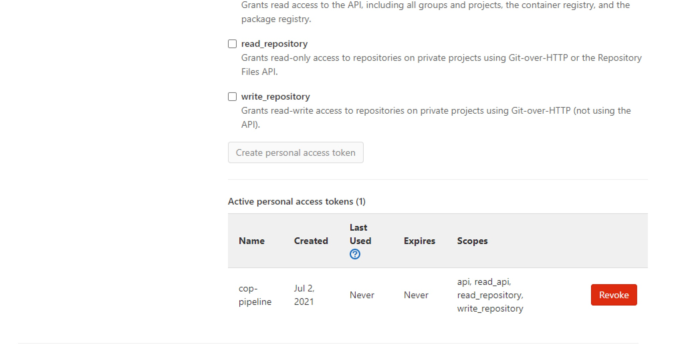
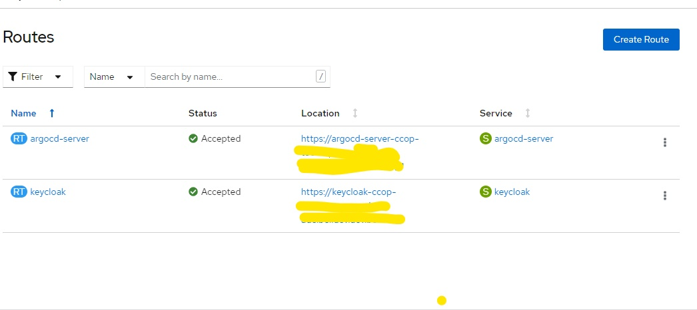
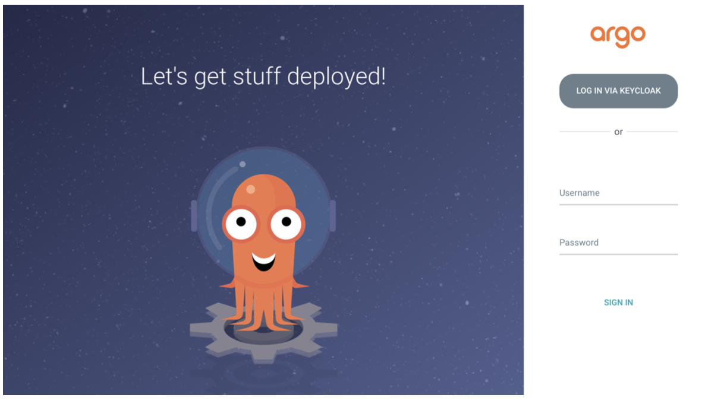
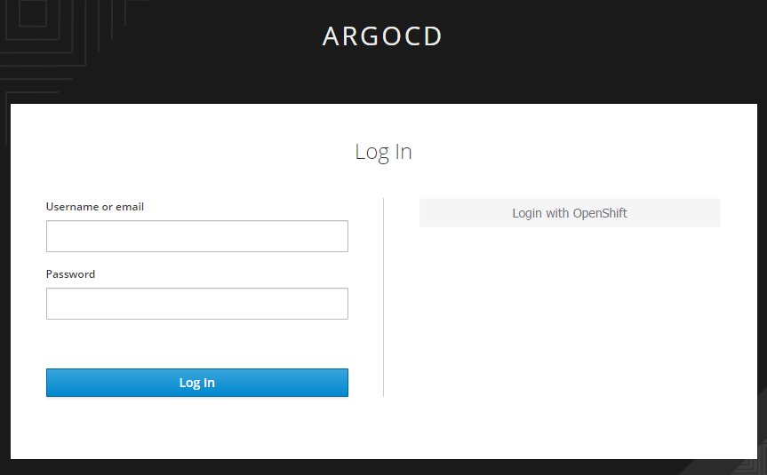
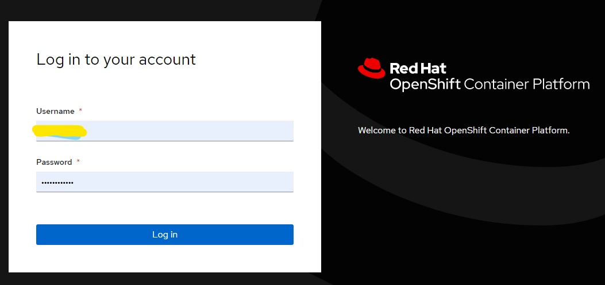
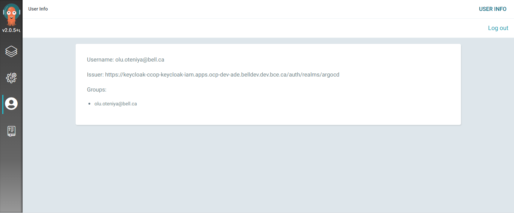

# Continuous Integration and Continuous Delivery Reference Implementation on OpenShift using OpenShift Pipelines

This article will attempt to walk you through a Reference Implementation of OpenShift Continuous Integration and Continuous Delivery (CICD) using a sample Quarkus project. For the sake of simpicity, the article will be broken down into 2 sections. They are as follows:-

- Continuous Integration Reference Implementation on OpenShift using OpenShift Pipelines

- Continuous Delivery Reference Implementation on OpenShift using OpenShift GitOps

## Continuous Integration Reference Implementation on OpenShift using OpenShift Pipelines

OpenShift Pipelines are based on the [Tekton project](https://tekton.dev)  - a new, Kubernetes and container native way to manage pipelines.The purpose of this article is demonstrate a reference implementation for the Openshift Pipelines using a sample Quarkus project.The pipeline will look like this: 

The pipeline will:

- Clone the source code repository (https://gitlab.xxx.corp.xxx.ca/AI/aiocp/sample-reactive-quarkus-app.git) on commit to `dev` branch

- Run test cases

- Build artifact for image

- In parallel scan build artifact for vulnerabilities using a `Trivy` task.

- Build an tag image using the source code `commitId`

- In parallel scan image locally for vulnerabilities using a `Trivy` task

- Push image to image repository - artifactory.xxx.corp.xxx.ca:5073 (`ccop-dev` repo)

- Scan image in remote image repository for vulnerabilities using a `Trivy` task

- Update the k8s repository under the path `k8s/overlays/dev` in `dev` branch to point to the latest image in the Artifactory registry

The Goal of this article is:

- Understand how to setup a CICD pipeline using OpenShift pipelines(Tekton) and OpenShift GitOps(ArgoCD)

- Serve as a quickstart for your CICD pipeline

### Prerequisites

The following are required to run this reference pipeline (and possibly your pipeline)* Ask your Cluster Administrator to install **Red Hat OpenShift Pipelines** incase you can't find it in the **Installed Operators** 

- Create an Openshift namespace - (In this case - `cop-pipeline`)

- Create or get access to the reference source code repository

- Create or get access to the reference k8s repository
- From your profile page, in the source code repository kindly setup an Access Token with the right permissions as shown in the screenshot below: 

(Note that the same Access Token was used for the k8s repository in the reference implementation. If you have different user profiles, you will have to setup multiple Access tokens)

- Setup a secret for the Access Token(s) in the Openshift namespace (`cop-pipeline`) and annotate the secret(s) (`tekton.dev/git-0: 'https://gitlab.xxx.corp.xxx.ca'`) as shown in the yaml file below:-  
```yaml
apiVersion: v1
metadata:
    name: gitlab-token
    namespace: cop-pipeline
annotations:
    tekton.dev/git-0: 'https://gitlab.xxx.corp.xxx.ca'
data:
    password: xxxxxxxxxxxxxxxxxx=
    username: xxxxxx==
type: kubernetes.io/basic-auth
```

- Add the secrets into the service account `pipeline` as shown in the yaml file below:-       
```yaml
kind: ServiceAccount
apiVersion: v1
metadata:
    name: pipeline
    namespace: cop-pipeline
secrets:
    - name: pipeline-token-xxxxx
    - name: pipeline-dockercfg-xxxx
    - name: gitlab-token
    - name: artifactory-token
imagePullSecrets:
    - name: pipeline-dockercfg-xxxxx
```

### Run CI Pipeline on Dev Environment

You can either manually run the pipeline or Creating webhooks on Gitlab to trigger the pipeline run on Gitlab to trigger the pipeline run. Kindly refer to the source yaml below:
```
apiVersion: tekton.dev/v1beta1
kind: Pipeline
metadata:
  name: ci-pipeline
  namespace: cop-pipeline
spec:
  params:
    - description: git url to clone
      name: git-source-url
      type: string
    - default: master
      description: 'git revision to checkout (branch, tag, sha, ref…)'
      name: git-source-revision
      type: string
    - description: image tag - truncated commit Id
      name: short-commit-id
      type: string
    - default: 'http://sonarqube-cicd-tools.apps.ocp-dev-ade.xxxdev.dev.xxx.ca'
      description: SonarQube url for static code analysis
      name: SONAR_URL
      type: string
    - default: cb98fc7b68ea37feb56d151e10b87d6dc596f4b2
      description: SonarQube authentication token for static code analysis
      name: SONAR_AUTH_TOKEN
      type: string
    - default: ./
      description: image path
      name: LOCAL_SCAN_PATH
      type: string
    - default: ./
      description: image path
      name: LOCAL_IMAGE_SCAN_PATH
      type: string
    - default: 'artifactory.xxx.corp.xxx.ca:5073/ccop-dev/quarkus-ref-image-dev'
      description: image path
      name: REMOTE_IMAGE_URL
      type: string
    - default: 'artifactory.xxx.corp.xxx.ca:5073/ccop-dev/quarkus-ref-image-dev'
      description: image path for security scanning
      name: SCAN_IMAGE_URL
      type: string
    - default: UNKNOWN
      description: vulnerability severity level
      name: SEVERITY_LEVELS
      type: string
    - default: 'https://gitlab.xxx.corp.xxx.ca/xx/xxxxx/tekton-pipeline.git'
      description: Kustomize git repo for CD
      name: KUSTOMIZE_GIT_URL
      type: string
    - default: k8s/overlays/dev
      description: Kustomize git repo context directory for CD
      name: KUSTOMIZE_GIT_CONTEXT_DIR
      type: string
    - default: dev
      description: Kustomize git repo branch
      name: KUSTOMIZE_GIT_BRANCH
      type: string
  tasks:
    - name: git-clone
      params:
        - name: url
          value: $(params.git-source-url)
        - name: revision
          value: $(params.git-source-revision)
        - name: sslVerify
          value: 'false'
        - name: noProxy
          value: 'true'
      taskRef:
        kind: ClusterTask
        name: git-clone
      workspaces:
        - name: output
          workspace: app-source
    - name: run-test-cases
      params:
        - name: GOALS
          value:
            - clean
            - test
      runAfter:
        - git-clone
      taskRef:
        kind: Task
        name: maven
      workspaces:
        - name: source
          workspace: app-source
        - name: maven-settings
          workspace: maven-settings
    - name: static-code-analysis
      params:
        - name: GOALS
          value:
            - 'sonar:sonar'
            - '-Dsonar.projectKey=ci-pipeline-ref-arc'
            - '-Dsonar.host.url=$(params.SONAR_URL)'
            - '-Dsonar.login=$(params.SONAR_AUTH_TOKEN)'
            - '-Dsonar.exclusions=**/*.java'
            - '-s  $(workspaces.maven-settings.path)/settings.xml'
      runAfter:
        - run-test-cases
      taskRef:
        kind: Task
        name: maven
      workspaces:
        - name: source
          workspace: app-source
        - name: maven-settings
          workspace: maven-settings
    - name: build-artifact
      params:
        - name: GOALS
          value:
            - '-DskipTests'
            - package
            - '-Dquarkus.native.container-build=true'
      runAfter:
        - static-code-analysis
      taskRef:
        kind: ClusterTask
        name: maven
      workspaces:
        - name: source
          workspace: app-source
        - name: maven-settings
          workspace: maven-settings
    - name: scan-build-artifact
      params:
        - name: SCAN_TYPE
          value: filesystem
        - name: SEVERITY_LEVELS
          value: $(params.SEVERITY_LEVELS)
        - name: SCAN_PATH_OR_IMAGE_URL
          value: $(params.LOCAL_SCAN_PATH)
      runAfter:
        - build-artifact
      taskRef:
        kind: Task
        name: trivy-scan
      workspaces:
        - name: local-image-repo
          workspace: app-source
    - name: build-image
      params:
        - name: IMAGE
          value: $(params.REMOTE_IMAGE_URL)
        - name: TLSVERIFY
          value: 'false'
      runAfter:
        - build-artifact
      taskRef:
        kind: Task
        name: buildah-build
      workspaces:
        - name: source
          workspace: app-source
        - name: varlibcontainers
          workspace: shared-image-repo
    - name: scan-local-image
      params:
        - name: SCAN_TYPE
          value: filesystem
        - name: SEVERITY_LEVELS
          value: $(params.SEVERITY_LEVELS)
        - name: SCAN_PATH_OR_IMAGE_URL
          value: $(params.LOCAL_IMAGE_SCAN_PATH)
      runAfter:
        - build-image
      taskRef:
        kind: Task
        name: trivy-scan
      workspaces:
        - name: local-image-repo
          workspace: shared-image-repo
    - name: push-image
      params:
        - name: IMAGE
          value: $(params.REMOTE_IMAGE_URL)
        - name: IMAGE_TAG
          value: $(params.short-commit-id)
        - name: TLSVERIFY
          value: 'false'
      runAfter:
        - build-image
      taskRef:
        kind: Task
        name: buildah-push
      workspaces:
        - name: source
          workspace: app-source
        - name: varlibcontainers
          workspace: shared-image-repo
    - name: scan-remote-image
      params:
        - name: SCAN_TYPE
          value: image
        - name: SEVERITY_LEVELS
          value: $(params.SEVERITY_LEVELS)
        - name: SCAN_PATH_OR_IMAGE_URL
          value: '$(params.SCAN_IMAGE_URL):$(params.short-commit-id)'
        - name: IGNORE_UNFIXED
          value: 'true'
      runAfter:
        - push-image
      taskRef:
        kind: Task
        name: trivy-scan
      workspaces:
        - name: local-image-repo
          workspace: shared-image-repo
    - name: update-kustomize-repo
      params:
        - name: gitRepositoryUrl
          value: $(params.KUSTOMIZE_GIT_URL)
        - name: gitRepositoryRevision
          value: $(params.KUSTOMIZE_GIT_BRANCH)
        - name: gitPath
          value: $(params.KUSTOMIZE_GIT_CONTEXT_DIR)
        - name: imageTag
          value: $(params.short-commit-id)
        - name: verbose
          value: 'true'
      runAfter:
        - scan-remote-image
      taskRef:
        kind: Task
        name: update-kustomize-repo
      workspaces:
        - name: repository
          workspace: kustomize-repo
  workspaces:
    - name: app-source
    - name: maven-settings
    - name: shared-image-repo
    - name: kustomize-repo
```

The screenshot below shows a Successful Pipeline Run on the Dev Environment 
The screenshot below shows a Successful Pipeline Run on the Dev Environment 

### Creating webhooks on Gitlab to trigger the pipeline run

On OpenShift, kindly setup the following Triggers

- Create a Trigger Template with the yaml file below:-
```yaml
apiVersion: triggers.tekton.dev/v1alpha1
kind: TriggerTemplate
metadata:
  name: ci-pipeline-template
  namespace: cop-pipeline
spec:
  params:
    - name: git-repo-url
    - name: git-revision
  resourcetemplates:
    - apiVersion: tekton.dev/v1beta1
      kind: PipelineRun
      metadata:
        generateName: ci-pipeline-
      spec:
        params:
          - name: git-source-url
            value: $(tt.params.git-repo-url)
          - name: git-source-revision
            value: $(tt.params.git-revision)
          - name: SONAR_URL
            value: 'http://sonarqube:9000'
          - name: SONAR_AUTH_TOKEN
            value: xxxxxxxxxxxxxxxxxxxxx
          - name: LOCAL_SCAN_PATH
            value: ./
          - name: LOCAL_IMAGE_SCAN_PATH
            value: ./
          - name: REMOTE_IMAGE_URL
            value: >-
              image-registry.openshift-image-registry.svc:5000/cop-pipeline/xxx-app-image
          - name: SEVERITY_LEVELS
            value: CRITICAL
          - name: KUSTOMIZE_GIT_URL
            value: 'https://gitlab.xxx.corp.xxx.ca/xx/xxxxx/tekton-pipeline.git'
          - name: KUSTOMIZE_GIT_CONTEXT_DIR
            value: k8s/overlays/dev
        pipelineRef:
          name: ci-pipeline
        workspaces:
          - name: app-source
            persistentVolumeClaim:
              claimName: workspace-pvc2
          - name: maven-settings
            persistentVolumeClaim:
              claimName: maven-settings-pvc
          - name: shared-image-repo
            persistentVolumeClaim:
              claimName: workspace-pvc2
          - emptyDir: {}
            name: kustomize-repo
```

- Create a Trigger Binding with the yaml file below:-
```yaml
apiVersion: triggers.tekton.dev/v1alpha1
kind: TriggerBinding
metadata:
  name: ci-pipeline-binding
  namespace: cop-pipeline
spec:
  params:
    - name: git-repo-url
      value: $(body.repository.git_http_url)
    - name: git-revision
      value: $(body.after)
```
- Create an Event listener with the yaml file below:-
```yaml
apiVersion: triggers.tekton.dev/v1alpha1
kind: EventListener
metadata:
  name: ci-pipeline
  namespace: cop-pipeline
spec:
  namespaceSelector: {}
  podTemplate: {}
  resources: {}
  serviceAccountName: pipeline
  triggers:
    - bindings:
        - kind: TriggerBinding
          ref: ci-pipeline-binding
      name: ci-pipeline
      template:
        ref: ci-pipeline-template
```

- On the Gitlab source code repository, go to `Settings/webhooks` and setup a webhook for the repo to initiate a Pipeline Run on commit. Kindly see screenshot below:-


### Promoting to Staging Environment

Refer to the source yaml below
```
apiVersion: tekton.dev/v1beta1
kind: Pipeline
metadata:
  name: uat-cd-pipeline
  namespace: cop-pipeline
spec:
  params:
    - description: Git commitId of the change to deploy
      name: IMAGE_TAG
      type: string
    - default: >-
        image-registry.openshift-image-registry.svc:xxxx/cop-pipeline/dapo-app-image
      description: Source image url without tag
      name: SRC_IMAGE_URL
      type: string
    - default: 'image-registry.openshift-image-registry.svc:xxxx/ccop-dev/dapo-app-image-uat'
      description: Destination image url without tag
      name: DEST_IMAGE_URL
      type: string
    - default: UNKNOWN
      description: Image Scan severity levels
      name: SEVERITY_LEVELS
      type: string
    - default: 'https://gitlab.xxx.xxxx.xxx.ca/tekton-pipeline.git'
      description: Kustomize git repo for CD
      name: KUSTOMIZE_GIT_URL
      type: string
    - default: k8s/overlays/uat
      description: Kustomize git repo context directory for CD
      name: KUSTOMIZE_GIT_CONTEXT_DIR
      type: string
    - default: uat
      description: Kustomize git repo branch
      name: KUSTOMIZE_GIT_BRANCH
      type: string
  tasks:
    - name: skopeo-copy
      params:
        - name: srcImageURL
          value: 'docker://$(params.SRC_IMAGE_URL):$(params.IMAGE_TAG)'
        - name: destImageURL
          value: 'docker://$(params.DEST_IMAGE_URL):$(params.IMAGE_TAG)'
        - name: srcTLSverify
          value: 'false'
        - name: destTLSverify
          value: 'false'
      taskRef:
        kind: ClusterTask
        name: skopeo-copy
      workspaces:
        - name: images-url
          workspace: images-url
    - name: trivy-scan
      params:
        - name: NO_PROXY
          value: 'localhost,127.0.0.1'
        - name: HTTP_PROXY
          value: ''
        - name: INSECURE_REGISTRY
          value: 'false'
        - name: SEVERITY_LEVELS
          value: $(params.SEVERITY_LEVELS)
        - name: SCAN_TYPE
          value: image
        - name: TRIVY_IMAGE
          value: >-
            image-registry.openshift-image-registry.svc:5000/cop-pipeline/trivy-image:v0.18.3
        - name: SCAN_PATH_OR_IMAGE_URL
          value: '$(params.DEST_IMAGE_URL):$(params.IMAGE_TAG)'
        - name: IGNORE_UNFIXED
          value: 'false'
      runAfter:
        - skopeo-copy
      taskRef:
        kind: Task
        name: trivy-scan
      workspaces:
        - name: local-image-repo
          workspace: image-repo
    - name: update-kustomize-repo
      params:
        - name: gitRepositoryUrl
          value: $(params.KUSTOMIZE_GIT_URL)
        - name: gitRepositoryRevision
          value: $(params.KUSTOMIZE_GIT_BRANCH)
        - name: gitPath
          value: $(params.KUSTOMIZE_GIT_CONTEXT_DIR)
        - name: fileName
          value: deployment-patches.yaml
        - name: imageTag
          value: $(params.IMAGE_TAG)
        - name: verbose
          value: 'true'
      runAfter:
        - trivy-scan
      taskRef:
        kind: Task
        name: update-kustomize-repo
      workspaces:
        - name: repository
          workspace: kustomize-repo
  workspaces:
    - name: images-url
    - name: image-repo
    - name: kustomize-repo
```

The pipeline will look like this:


The pipeline will:   

- Skopeo copy from dev image repository to UAT image repository

- Scan image in remote image repository for vulnerabilities using a Trivy task

- Update the [repository ](https://gitlab.xxx.corp.xx.ca/xx/xxxxx/tekton-pipeline.git) under the path `k8s/overlays/uat` in `uat` branch to point to the latest image in the Artifactory registry

### Promoting to Prod Environment

Refer to the source yaml below:-
```
apiVersion: tekton.dev/v1beta1
kind: Pipeline
metadata:
  name: prod-cd-pipeline
  namespace: cop-pipeline
spec:
  params:
    - description: Git commitId of the change to deploy
      name: IMAGE_TAG
      type: string
    - default: >-
        image-registry.openshift-image-registry.svc:xxxx/cop-pipeline/dapo-app-image
      description: Source image url without tag
      name: SRC_IMAGE_URL
      type: string
    - default: 'image-registry.openshift-image-registry.svc:xxxx/ccop-dev/dapo-app-image-prod'
      description: Destination image url without tag
      name: DEST_IMAGE_URL
      type: string
    - default: UNKNOWN
      description: Image Scan severity levels
      name: SEVERITY_LEVELS
      type: string
    - default: 'https://gitlab.xxx.xxxx.xxx.ca/tekton-pipeline.git'
      description: Kustomize git repo for CD
      name: KUSTOMIZE_GIT_URL
      type: string
    - default: k8s/overlays/prod
      description: Kustomize git repo context directory for CD
      name: KUSTOMIZE_GIT_CONTEXT_DIR
      type: string
    - default: prod
      description: Kustomize git repo branch
      name: KUSTOMIZE_GIT_BRANCH
      type: string
  tasks:
    - name: skopeo-copy
      params:
        - name: srcImageURL
          value: 'docker://$(params.SRC_IMAGE_URL):$(params.IMAGE_TAG)'
        - name: destImageURL
          value: 'docker://$(params.DEST_IMAGE_URL):$(params.IMAGE_TAG)'
        - name: srcTLSverify
          value: 'false'
        - name: destTLSverify
          value: 'false'
      taskRef:
        kind: ClusterTask
        name: skopeo-copy
      workspaces:
        - name: images-url
          workspace: images-url
    - name: trivy-scan
      params:
        - name: NO_PROXY
          value: 'localhost,127.0.0.1'
        - name: HTTP_PROXY
          value: ''
        - name: INSECURE_REGISTRY
          value: 'false'
        - name: SEVERITY_LEVELS
          value: $(params.SEVERITY_LEVELS)
        - name: SCAN_TYPE
          value: image
        - name: TRIVY_IMAGE
          value: >-
            image-registry.openshift-image-registry.svc:5000/cop-pipeline/trivy-image:v0.18.3
        - name: SCAN_PATH_OR_IMAGE_URL
          value: '$(params.DEST_IMAGE_URL):$(params.IMAGE_TAG)'
        - name: IGNORE_UNFIXED
          value: 'false'
      runAfter:
        - skopeo-copy
      taskRef:
        kind: Task
        name: trivy-scan
      workspaces:
        - name: local-image-repo
          workspace: image-repo
    - name: update-kustomize-repo
      params:
        - name: gitRepositoryUrl
          value: $(params.KUSTOMIZE_GIT_URL)
        - name: gitRepositoryRevision
          value: $(params.KUSTOMIZE_GIT_BRANCH)
        - name: gitPath
          value: $(params.KUSTOMIZE_GIT_CONTEXT_DIR)
        - name: fileName
          value: deployment-patches.yaml
        - name: imageTag
          value: $(params.IMAGE_TAG)
        - name: verbose
          value: 'true'
      runAfter:
        - trivy-scan
      taskRef:
        kind: Task
        name: update-kustomize-repo
      workspaces:
        - name: repository
          workspace: kustomize-repo
  workspaces:
    - name: images-url
    - name: image-repo
    - name: kustomize-repo
```

The pipeline will look like this:-


The pipeline will:  

- Skopeo copy from dev image repository to UAT image repository

- Scan image in remote image repository for vulnerabilities using a `Trivy` task

- Update the [repository](https://gitlab.xxx.corp.xxx.ca/xx/xxxx/tekton-pipeline.git) under the path `k8s/overlays/prod` in `master` branch to point to the latest image in the image repository (e.g Artifactory)   

## Continuous Delivery Reference Implementation on OpenShift using OpenShift GitOps

Ask your Cluster Administrator to install **Red Hat OpenShift GitOps** incase you can't find it in the **Installed Operators** 

### Setting up a Tenant ArgoCD instance

The following are steps for setting up a tenant ArgoCD instance

- Create an argocd instance namespace on OpenShift

- Create all the namespaces that the argocd instance will manage i.e namepaces to deploy the applications.
If you have access to create namespaces, you can use the code snippet below including the label  `argocd.argoproj.io/managed-by: <argocd instance namespace>`:
``` yaml
for namespace in ccop-ref-dev ccop-ref-uat ccop-ref-prod
do
    oc new-project $namespace
    oc label namespace $namespace argocd.argoproj.io/managed-by=<argocd instance namespace>
done;

```
 
- Create a cluster config secret in the argocd instance namespace
``` yaml
apiVersion: v1
stringData:
  config: '{"tlsClientConfig":{"insecure":false}}'
  name: in-cluster
  namespaces: ccop-ref-dev,ccop-ref-uat,ccop-ref-prod
  server: https://kubernetes.default.svc
kind: Secret
metadata:
  annotations:
    managed-by: argocd.argoproj.io
  labels:
    argocd.argoproj.io/secret-type: cluster
  name: in-cluster
type: Opaque
```

- Create an argocd instance in the <argocd instance namespace>
``` yaml
apiVersion: argoproj.io/v1alpha1
kind: ArgoCD
metadata:
  name: argocd
spec:
  controller:
    resources:
      limits:
          cpu: 500m
          memory: 1024Mi
      requests:
          cpu: 50m
          memory: 256Mi
  redis:
    resources:
      limits:
          cpu: 500m
          memory: 512Mi
      requests:
          cpu: 50m
          memory: 256Mi
  server:
    resources:
      limits:
          cpu: 500m
          memory: 512Mi
      requests:
          cpu: 50m
          memory: 256Mi
    route:
      enabled: true
  repo:
    resources:
      limits:
          cpu: 500m
          memory: 512Mi
      requests:
          cpu: 50m
          memory: 256Mi
  sso:
    provider: keycloak
    verifyTLS: false
    resources:
      limits:
          cpu: 1000m
          memory: 1024Mi
      requests:
          cpu: 500m
          memory: 512Mi
```

- Kindly read further to configure RHSSO and deploy applications.


### Configure RHSSO for OpenShift GitOps Login
 This section describes the steps to Install, Configure(Setup Login with OpenShift) the RHSSO with OpenShift GitOps operator v1.2.
​
 GitOps operator v1.2 comes with an embedded RHSSO which is not supposed to be used for any other use case aside from GitOps.
 
#### Installation
To enable the embedded RHSSO, ensure you patch your argocd custom resource with the appropritate resource requirements and make sure the keycloak pods are up and running and the available replica count is 1. It usually takes 2-3 minutes.
​
``` yaml
...
​
  sso:
    provider: keycloak
    verifyTLS: false
    resources:
      limits:
          cpu: 1000m
          memory: 1024Mi
      requests:
          cpu: 500m
          memory: 512Mi
```
​
Keycloak communicates with OpenShift Oauth Server through proxy. Below are some additional steps that need to be followed to get Keycloak integrated with OpenShift Oauth Login. 

1. Login to the Keycloak Pod `oc exec -it dc/keycloak -n <argocd instance namespace>  -- /bin/bash`
​
2. Run JBoss Cli command `/opt/eap/bin/jboss-cli.sh`
​
3. Start an Embedded Standalone Server `embed-server --server-config=standalone-openshift.xml`
​
4. Setup the Proxy mappings.
`/subsystem=keycloak-server/spi=connectionsHttpClient/provider=default:write-attribute(name=properties.proxy-mappings,value=["oauth-openshift.apps.xx;http://xxxweb.int.xxx.ca:xxxx"])`
​
5. Stop the Embedded Server `quit`
​
6. Reload JBoss `/opt/eap/bin/jboss-cli.sh --connect --command=:reload`
​
7. Exit oc remote shell to keycloak pod `exit`

#### Login with OpenShift
Go to the OpenShift Console -> Networking -> Routes. Click on the <argocd-instance>-server route url to access the Argo CD UI.
​


​
You will be redirected to Argo CD Login Page.
​
You can see an option to LOG IN VIA KEYCLOAK apart from the usual ArgoCD login. Click on the button. (Please choose a different browser or incognito window to avoid caching issues).
​


​
You will be redirected to a new page which provides you an option to Login with OpenShift. Click on the button to get redirected to the OpenShift Login Page.
​


​


​
Provide the OpenShift login credentials to get redirected to Argo CD. You can look at the user details by clicking on the User Information Tab as shown below.
​



#### Configure Argo CD RBAC
By default, any user logged into Argo CD using RHSSO will be a read-only user.
​
`policy.default: role:readonly`
​
This behavior can be modified by updating the argocd-rbac-cm configmap data section.
​
`oc edit cm argocd-rbac-cm -n <namespace>`
​
``` yaml 
... metadata ...
... data:
  policy.default: role:readonly
​
```
​
You can also do this via a patch
​
`oc patch cm/argocd-rbac-cm -n openshift-gitops --type=merge -p '{"data":{"policy.default":"role:admin"}}'`
​
A detailed information on configuring RBAC to your Argo CD instances is provided [here ](https://argo-cd.readthedocs.io/en/stable/operator-manual/rbac/).

### Deployment on Dev Environment

Kindly carry out the following activities:-

- Kindly setup the namespace `ccop-ref-dev` (if it does not exist) on Openshift for deployment using this label `argocd.argoproj.io/managed-by: <argocd instance namespace>`. If the namespace is not labelled with this value - `argocd.argoproj.io/managed-by: <argocd instance namespace>`, after creation, kindly reach out to the cluster admin.

- Log into  Argo CD cluster, go to `Settings/Repositories` and click on the button `+ CONNECT REPO USING HTTPS` in order to permit connection to your k8s repo. Kindly see screenshots below:- 
 


- Create the following in <argocd instance namespace> on the dev environment:
```yaml
apiVersion: argoproj.io/v1alpha1
kind: AppProject
metadata:
    name: dev-project
    namespace: <argocd instance namespace>
spec:
    clusterResourceWhitelist:
        - group: '*'
        kind: '*'
    destinations:
        - namespace: ccop-ref-prod
        server: 'https://kubernetes.default.svc'
    sourceRepos:
        - 'https://gitlab.xxx.corp.xxx.ca/xx/xxxxx/tekton-pipeline.git'
    status: {}
```
```yaml
apiVersion: argoproj.io/v1alpha1
kind: Application
metadata:
    name: quarkus-app-dev
spec:
    destination:
        namespace: ccop-ref-dev
        server: 'https://kubernetes.default.svc'
    source:
        path: k8s/overlays/dev
        repoURL: 'https://gitlab.xxx.corp.xxx.ca/xx/xxxxx/tekton-pipeline.git'
        targetRevision: dev
    project: dev-project
    syncPolicy:
        automated:
        prune: true
        selfHeal: true
```

### Deployment on Staging Environment

Kindly carry out the following activities:-

- Kindly setup the namespace `ccop-ref-uat` (if it does not exist) on Openshift for deployment using this label `argocd.argoproj.io/managed-by: <argocd instance namespace>`. If the namespace is not labelled with this value - `argocd.argoproj.io/managed-by: <argocd instance namespace>`, after creation, kindly reach out to the cluster admin.

- Kindly create the following n the <argocd instance namespace> of the Staging environment:- 
```yaml
apiVersion: argoproj.io/v1alpha1
kind: AppProject
metadata:
    name: uat-project
    namespace: <argocd instance namespace>
spec:
    clusterResourceWhitelist:
        - group: '*'
        kind: '*'
    destinations:
        - namespace: ccop-ref-uat
        server: 'https://kubernetes.default.svc'
    sourceRepos:
        - 'https://gitlab.xxx.corp.xxx.ca/xx/xxxxx/tekton-pipeline.git'
    status: {}
```
``` yaml
apiVersion: argoproj.io/v1alpha1
kind: Application
metadata:
    name: quarkus-app-dev
spec:
    destination:
        namespace: ccop-ref-dev
        server: 'https://kubernetes.default.svc'
    source:
        path: k8s/overlays/uat
        repoURL: 'https://gitlab.xxx.corp.xxx.ca/xx/xxxxx/tekton-pipeline.git'
        targetRevision: uat
    project: uat-project
    syncPolicy:
        automated:
        prune: true
        selfHeal: true
```

### Deployment on Production Environment

Kindly carry out the following activities:-

- Kindly setup the namespace `ccop-ref-prod` (if it does not exist) on Openshift for deployment using this label `argocd.argoproj.io/managed-by: <argocd instance namespace>`. If the namespace is not labelled with this value - `argocd.argoproj.io/managed-by: <argocd instance namespace>`, after creation, kindly reach out to the cluster admin.

- Kindly create the following in the <argocd instance namespace> of the Production environment:- 
``` yaml
apiVersion: argoproj.io/v1alpha1
kind: AppProject
metadata:
    name: prod-project
    namespace: <argocd instance namespace>
spec:
    clusterResourceWhitelist:
        - group: '*'
        kind: '*'
    destinations:
        - namespace: ccop-ref-prod
        server: 'https://kubernetes.default.svc'
    sourceRepos:
        - 'https://gitlab.xxx.corp.xxx.ca/xx/xxxxx/tekton-pipeline.git'
    status: {}
```
``` yaml
apiVersion: argoproj.io/v1alpha1
kind: Application
metadata:
    name: quarkus-app-prod
spec:
    destination:
        namespace: ccop-ref-dev
        server: 'https://kubernetes.default.svc'
    source:
        path: k8s/overlays/prod
        repoURL: 'https://gitlab.xxx.corp.xxx.ca/xx/xxxxx/tekton-pipeline.git'
        targetRevision: master
    project: prod-project
    syncPolicy:
        automated:
        prune: true
        selfHeal: true
```
