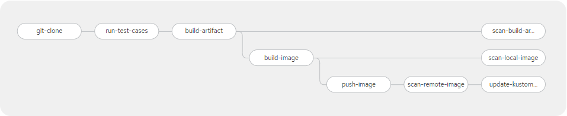
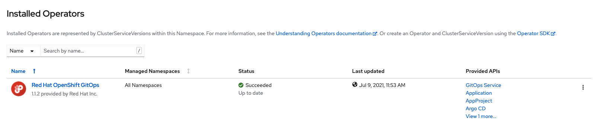
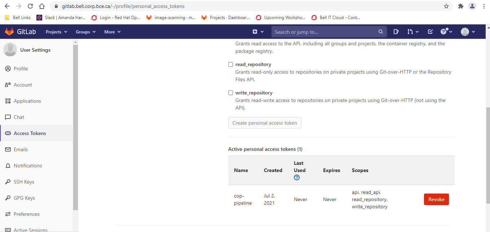
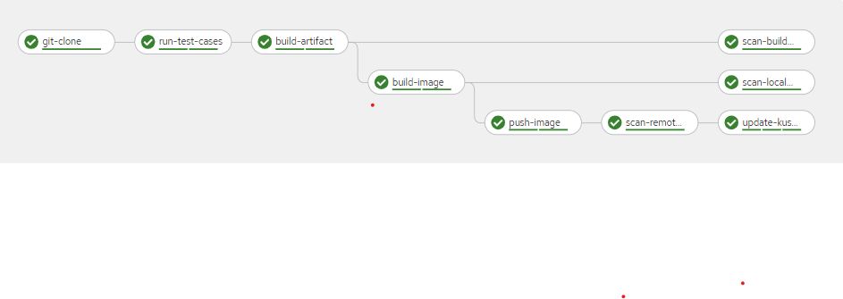
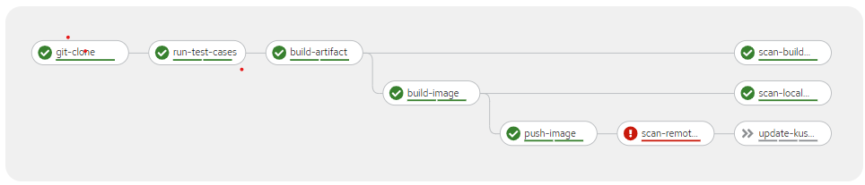
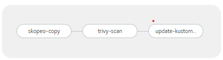
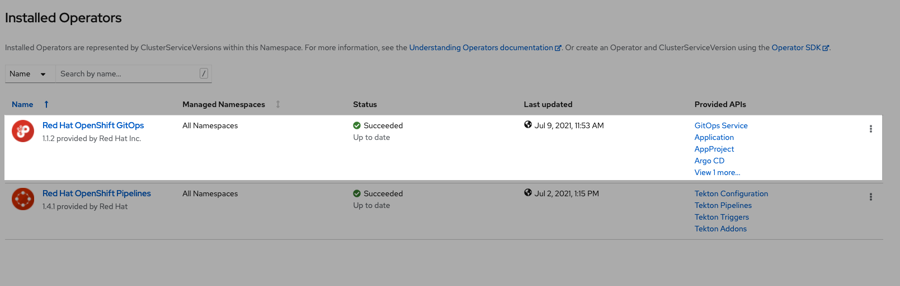
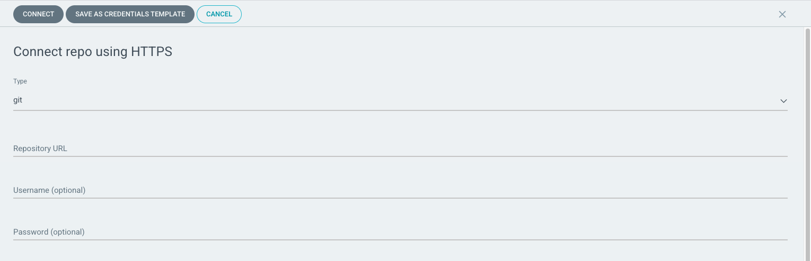
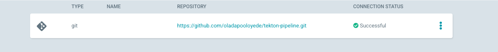

<h1>Continuous Integration and Continuous Delivery (CICD) on OpenShift - Reference Implementation </h1>

 

This article will attempt to walk you through a Reference Implementation of OpenShift Continuous Integration and Continuous Delivery (CICD) using a sample Quarkus project. For the sake of simpicity, the article will be broken down into 2 sections. They are as follows:-

<Ul>
    <li><a href="#ci">Continuous Integration Reference Implementation on OpenShift using OpenShift Pipelines (Tekton Project)</a></li>
    <li><a href="#cd">Continuous Delivery Reference Implementation on OpenShift using OpenShift GitOps</a></li>
</Ul>

 

<h2 id="ci">Continuous Integration Reference Implementation on OpenShift using OpenShift Pipelines (Tekton Project)</h2>

 

OpenShift Pipelines are based on the Tekton project (https://tekton.dev) - a new, Kubernetes and container native way to manage pipelines.

The purpose of this article is demonstrate a reference implementation for the Openshift Pipelines using a sample Quarkus project.

The pipeline will look like this:-
 

</img>

 

The pipeline will:
<Ul>
    <li>Clone the source code repository (https://github.com/oladapooloyede/Second-quarkus-reactive-project.git) on commit to <code>dev</code> branch</li>
    <li>Run test cases</li>
    <li>Build artifact for image</li>
    <li>In parallel scan build artifact for vulnerabilities using a <a href="https://github.com/aquasecurity/trivy"><code>Trivy</code></a> task </li>
    <li>Build an tag image using the source code <code>commitId</code></li>
    <li>In parallel scan image locally for vulnerabilities using a <a href="https://github.com/aquasecurity/trivy"><code>Trivy</code></a> task</li>
    <li>Push image to image repository - artifactory.xxxx.corp.xxx.ca:5073 (<code>ccop-dev</code> repo)</li>
    <li>Scan image in remote image repository for vulnerabilities using a <a href="https://github.com/aquasecurity/trivy"><code>Trivy</code></a> task</li>
    <li>Update the repository https://github.com/oladapooloyede/tekton-pipeline.git under the path <code>k8s/overlays/dev</code> in <code>dev</code> branch to point to the latest image in the Artifactory registry</li> 
</Ul>

 
The Goal of this of article is:
<Ul>
    <li>Understand how to setup a CICD pipeline using OpenShift pipelines(Tekton) and OpenShift GitOps(ArgoCD)</li>
    <li>Serve as a quickstart for your CICD pipeline</li>
</Ul>

<h3>Prerequisites</h3>
 

The following are required to run this reference pipeline (and possibly your pipeline)

<Ul>
    <li>Ask your Cluster Administrator to install <b>Red Hat OpenShift Pipelines</b> incase you can't find it in the <b>Installed Operators</b> </img></li>
    <li>Create an Openshift namespace - (In this case - <code>cop-pipeline</code>)</li>
    <li>Create or get access to the reference source code repository (https://github.com/oladapooloyede/Second-quarkus-reactive-project.git)</li>
    <li>Create or get access to the reference k8s repository for continuous deployment (https://github.com/oladapooloyede/tekton-pipeline.git)</li>
    <li>From your profile page, in the source code repository kindly setup an Access Token with the right permissions as shown in the screenshot below:-</img>
    (Kindly note that the same Access Token was used for the k8s repository in the reference implementation. If you have different user profiles, you will have to setup multiple Access tokens)</li>
    <li>Setup a secret for the Access Token(s) in the Openshift namespace (<code>cop-pipeline</code>) and annotate the secret(s) (<code>tekton.dev/git-0: 'https://gitlab.xxx.corp.xxx.ca</code>) as shown in the yaml file below:-
    <pre>
    <code>
    apiVersion: v1
    metadata:
        name: gitlab-token
        namespace: cop-pipeline
    annotations:
        tekton.dev/git-0: 'https://gitlab.xxx.corp.xxx.ca'
    data:
        password: xxxxxxxxxxxxxxxxxx=
        username: xxxxxx==
    type: kubernetes.io/basic-auth
    </code>
    </pre>
    </li>
    <li>Add the secrets into the service account <code>pipeline</code> as shown in the yaml file below:-
     <pre>
    <code>
    kind: ServiceAccount
    apiVersion: v1
    metadata:
        name: pipeline
        namespace: cop-pipeline
    secrets:
        - name: pipeline-token-xxxxx
        - name: pipeline-dockercfg-xxxx
        - name: gitlab-token
        - name: artifactory-token
    imagePullSecrets:
        - name: pipeline-dockercfg-xxxxx
    </code>
    </pre>
    </li>
</Ul>
 
<h3>Run CI Pipeline on Dev Environment</h3>

Kindly refer to this for a source yaml file for the pipeline - <a href="https://github.com/oladapooloyede/tekton-pipeline/tree/master/pipelines">ci-pipeline.yaml</a> 

 

The screenshot below shows a Successful Pipeline Run on the Dev Environment

</img>

The screenshot below shows a Successful Pipeline Run on the Dev Environment

</img>
 

<h3>Promoting to UAT Environment</h3>

Kindly refer to this file for the yaml source - <a href="https://gitlab.xxxx.corp.xxx.ca/AI/aiocp/tekton-pipeline/-/blob/master/pipelines/uat-cd-pipeline.yaml">uat-cd-pipeline.yaml</a>

The pipeline will look like this:- </img>

The pipeline will:
    <ul>
        <li>Skopeo copy from dev image repository to UAT image repository</li>
        <li>Scan image in remote image repository for vulnerabilities using a <a href="https://github.com/aquasecurity/trivy"><code>Trivy</code></a> task</li>
        <li>Update the repository https://github.com/oladapooloyede/tekton-pipeline.git under the path <code>k8s/overlays/uat</code> in <code>uat</code> branch to point to the latest image in the Artifactory registry</li> 
    </ul>

 

<h3>Promoting to Prod Environment</h3>

Kindly refer to this file for the yaml source - <a href="https://gitlab.xxxx.corp.xxx.ca/AI/aiocp/tekton-pipeline/-/blob/master/pipelines/prod-cd-pipeline.yaml">prod-cd-pipeline.yaml</a>

The pipeline will look like this:- </img>

The pipeline will:
    <ul>
        <li>Skopeo copy from dev image repository to UAT image repository</li>
        <li>Scan image in remote image repository for vulnerabilities using a <a href="https://github.com/aquasecurity/trivy"><code>Trivy</code></a> task</li>
        <li>Update the repository https://github.com/oladapooloyede/tekton-pipeline.git under the path <code>k8s/overlays/prod</code> in <code>master</code> branch to point to the latest image in the Artifactory registry</li> 
    </ul>

 

 
 

<h2 id="cd">Continuous Delivery Reference Implementation on OpenShift using OpenShift GitOps (ArgoCD)</h2>
 

Ask your Cluster Administrator to install <b>Red Hat OpenShift GitOps</b> incase you can't find it in the <b>Installed Operators</b> </img> 

 
<h3>Deployment on Dev Environment</h3>
 

Kindly carry out the following activities:-

<ul>
<li>Kindly setup the namespace <code>ccop-ref-dev</code> on Openshift for deployment</li>
<li>Log into  Argo CD cluster, go to <code>Settings/Repositories</code> and click on the button <code>+ CONNECT REPO USING HTTPS</code> in order to permit connection to your k8s repo. Kindly see screenshots below:-

</li>
<li>Kindly create the following on the dev environment:-
  <pre>
    <code>
    apiVersion: argoproj.io/v1alpha1
    kind: AppProject
    metadata:
        name: dev-project
        namespace: openshift-gitops
    spec:
        clusterResourceWhitelist:
            - group: '*'
            kind: '*'
        destinations:
            - namespace: ccop-ref-prod
            server: 'https://kubernetes.default.svc'
        sourceRepos:
            - 'https://gitlab.xxx.corp.xxx.ca/AI/aiocp/tekton-pipeline.git'
        status: {}
    </code>
    </pre>

  <pre>
    <code>
    apiVersion: argoproj.io/v1alpha1
    kind: Application
    metadata:
        name: quarkus-app-dev
    spec:
        destination:
            namespace: ccop-ref-dev
            server: 'https://kubernetes.default.svc'
        source:
            path: k8s/overlays/dev
            repoURL: 'https://gitlab.xxx.corp.bce.ca/AI/aiocp/tekton-pipeline.git'
            targetRevision: dev
        project: dev-project
        syncPolicy:
            automated:
            prune: true
            selfHeal: true
    </code>
    </pre>
</li>
</ul>

 
<h3>Deployment on UAT Environment</h3>
 

Kindly carry out the following activities:-

<ul>
<li>Kindly setup the namespace <code>ccop-ref-uat</code> on Openshift for deployment</li>
<li>Kindly create the following on the dev environment:-
  <pre>
    <code>
    apiVersion: argoproj.io/v1alpha1
    kind: AppProject
    metadata:
        name: uat-project
        namespace: openshift-gitops
    spec:
        clusterResourceWhitelist:
            - group: '*'
            kind: '*'
        destinations:
            - namespace: ccop-ref-uat
            server: 'https://kubernetes.default.svc'
        sourceRepos:
            - 'https://gitlab.xxx.corp.xxx.ca/AI/aiocp/tekton-pipeline.git'
        status: {}
    </code>
    </pre>

  <pre>
    <code>
    apiVersion: argoproj.io/v1alpha1
    kind: Application
    metadata:
        name: quarkus-app-dev
    spec:
        destination:
            namespace: ccop-ref-dev
            server: 'https://kubernetes.default.svc'
        source:
            path: k8s/overlays/uat
            repoURL: 'https://gitlab.xxx.corp.bce.ca/AI/aiocp/tekton-pipeline.git'
            targetRevision: uat
        project: uat-project
        syncPolicy:
            automated:
            prune: true
            selfHeal: true
    </code>
    </pre>
</li>
</ul>

 
<h3>Deployment on Prod Environment</h3>
 

Kindly carry out the following activities:-

<ul>
<li>Kindly setup the namespace <code>ccop-ref-prod</code> on Openshift for deployment</li>
<li>Kindly create the following on the dev environment:-
  <pre>
    <code>
    apiVersion: argoproj.io/v1alpha1
    kind: AppProject
    metadata:
        name: prod-project
        namespace: openshift-gitops
    spec:
        clusterResourceWhitelist:
            - group: '*'
            kind: '*'
        destinations:
            - namespace: ccop-ref-prod
            server: 'https://kubernetes.default.svc'
        sourceRepos:
            - 'https://gitlab.xxx.corp.xxx.ca/AI/aiocp/tekton-pipeline.git'
        status: {}
    </code>
    </pre>

  <pre>
    <code>
    apiVersion: argoproj.io/v1alpha1
    kind: Application
    metadata:
        name: quarkus-app-prod
    spec:
        destination:
            namespace: ccop-ref-dev
            server: 'https://kubernetes.default.svc'
        source:
            path: k8s/overlays/prod
            repoURL: 'https://gitlab.xxx.corp.bce.ca/AI/aiocp/tekton-pipeline.git'
            targetRevision: master
        project: prod-project
        syncPolicy:
            automated:
            prune: true
            selfHeal: true
    </code>
    </pre>
</li>
</ul>